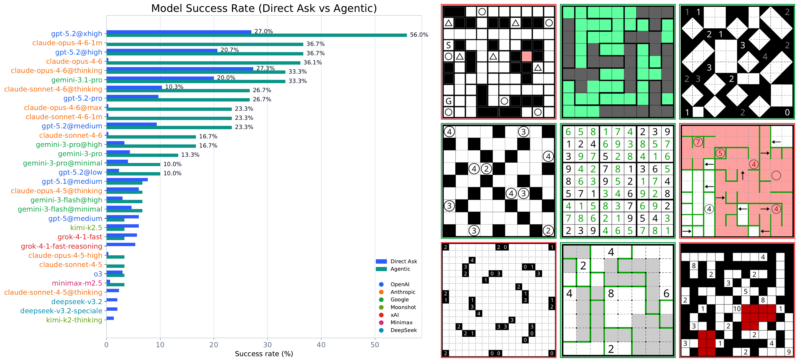

# Pencil Puzzle Bench

A benchmark for evaluating LLM reasoning through pencil puzzles — constraint-satisfaction problems closely related to NP-complete problems — with deterministic, step-level verification.

**Paper:** [Pencil Puzzle Bench: A Benchmark for Multi-Step Verifiable Reasoning](https://arxiv.org/abs/2603.02119)



## Features

- **62,000+ puzzles** across **94 puzzle types** sourced from [puzz.link](https://puzz.link), each with a unique solution verified by [cspuz-solver2](https://github.com/semiexp/cspuz-solver2) (SAT-based constraint solver)
- **Step-level verification** via [pzpr.js](https://github.com/robx/pzprjs) — every intermediate board state is checked against variety-specific constraints, localizing errors to the exact rule violated (e.g., "Two shaded cells are adjacent" in Nurikabe, "Loop crosses itself" in Slitherlink)
- **Dense reward signals** — per-move constraint checking enables process supervision and reinforcement learning
- **Gymnasium environment** for RL training
- **Verifiers environment** for GRPO training with [verifiers](https://github.com/PrimeIntellect-ai/verifiers)
- **Benchmark harness** with pluggable strategies, built on [pydantic-ai](https://ai.pydantic.dev/)
- **Local model support** — works with LM Studio, ollama, vLLM, or any OpenAI-compatible endpoint

## Install

### Prerequisites

**Node.js** is required — the puzzle engine (pzpr.js) runs in a Node.js subprocess via [JSPyBridge](https://github.com/nicedouble/JSPyBridge).

```bash
# macOS
brew install node

# Ubuntu/Debian
apt install nodejs npm

# Or use nvm
nvm install 20
```

### Install ppbench

```bash
pip install ppbench          # Core: puzzles, gym env, pydantic-ai framework
pip install ppbench[all]     # + OpenAI and Anthropic API clients
```

Install only the providers you need:

```bash
pip install ppbench[openai]      # + OpenAI client
pip install ppbench[anthropic]   # + Anthropic client
```

Local models (LM Studio, ollama, vLLM) work with just the base install — no provider extras needed.

### Docker

Minimal Dockerfile for a clean environment:

```dockerfile
FROM python:3.12-slim
RUN apt-get update && apt-get install -y --no-install-recommends nodejs npm curl \
    && rm -rf /var/lib/apt/lists/*
RUN curl -LsSf https://astral.sh/uv/install.sh | sh
ENV PATH="/root/.local/bin:$PATH"
WORKDIR /app
COPY . .
RUN uv sync --all-extras
```

```bash
docker build -t ppbench .
docker run --rm ppbench uv run python -c \
  "from ppbench import Puzzle, load_dataset; print(len(load_dataset('golden_30')), 'puzzles')"
```

See [`Dockerfile.test`](Dockerfile.test) for a full smoke test.

## Quick Start

```python
from ppbench import Puzzle, load_dataset

# Load a puzzle from the benchmark
records = load_dataset("golden")  # 300 curated puzzles
record = records[0]

# Create and interact with a puzzle
puzzle = Puzzle.from_url(record["puzzlink_url"])
print(puzzle.pid)           # e.g., "sudoku"
print(puzzle.get_state())   # board state as text

# Apply moves and check
puzzle.send_move("mouse,left,3,5")
violations = puzzle.check()      # [] if valid
solved = puzzle.is_complete()    # True when solved

# Render as SVG
svg = puzzle.svg()
```

## Gymnasium Environment

```python
from ppbench import PuzzleEnv, load_dataset

records = load_dataset("golden")
env = PuzzleEnv(puzzle_url=records[0]["puzzlink_url"])
obs, info = env.reset()

# Standard Gymnasium loop
obs, reward, terminated, truncated, info = env.step("mouse,left,3,5")
# reward = 1.0 when puzzle is solved
```

## Verifiers Environment (GRPO Training)

```python
from ppbench.verifiers_env import load_environment

env = load_environment("golden")
# Use with verifiers GRPO training pipeline
```

## Datasets

| Name | Size | Description |
|------|------|-------------|
| `golden` / `golden_300` | 300 puzzles | Curated benchmark (20 types × 15 each), bundled |
| `golden_30` | 30 puzzles | Small subset for expensive agentic strategies, bundled |
| `full` | 62,231 puzzles | All 94 puzzle types ([HuggingFace](https://huggingface.co/datasets/bluecoconut/pencil-puzzle-bench)) |

```python
from ppbench import load_dataset

# Bundled datasets (no download needed)
records = load_dataset("golden")      # 300 puzzles
records = load_dataset("golden_30")   # 30 puzzles
```

### Full dataset

Download from HuggingFace (one JSONL file):

```bash
# Using the huggingface-cli
pip install huggingface-hub
huggingface-cli download bluecoconut/pencil-puzzle-bench \
    full_dataset.jsonl \
    --repo-type dataset \
    --local-dir ppbench/data
```

Then load it:

```python
records = load_dataset("full")  # 62,231 puzzles
```

Each record contains:
- `puzzlink_url` — canonical puzzle URL (encodes the puzzle state)
- `pid` — puzzle type (e.g., `"sudoku"`, `"slither"`, `"tapa"`)
- `number_required_moves` — minimum moves to solve
- `solution` — decoded solution with `moves_full`, `moves_required`, `moves_hint`

## Running the Benchmark

```bash
# Set API keys for the providers you want to use
export OPENAI_API_KEY=...
export ANTHROPIC_API_KEY=...

# Quick test: 1 puzzle, both strategies
uv run python -u examples/quick_test.py

# Multi-model comparison
uv run python -u examples/multi_model.py

# Sweep an entire dataset
uv run python -u examples/dataset_sweep.py

# Analyze results
uv run python -u examples/analyze_results.py
```

Results are cached per (model, strategy, puzzle) — re-runs skip completed work.

### Using a local model

Point the benchmark at any OpenAI-compatible endpoint (LM Studio, ollama, vLLM, etc.):

```bash
# Default: http://127.0.0.1:1234/v1 (LM Studio default)
export LOCAL_API_BASE=http://127.0.0.1:1234/v1

# Or for ollama:
export LOCAL_API_BASE=http://127.0.0.1:11434/v1
```

```python
import asyncio
from ppbench.benchmarks import run, DirectAskStrategy

asyncio.run(run(
    models=["local/qwen3.5-35b-a3b"],
    strategies=[DirectAskStrategy],
    dataset="golden_30",
))
```

The model name after `local/` is passed directly to the server — use whatever model name your server expects.

## Architecture Guide

### Core primitive

`ppbench.Puzzle` wraps a headless [pzpr.js](https://github.com/robx/pzprjs) puzzle instance running in Node.js. pzpr.js is the engine behind the [puzz.link](https://puzz.link) puzzle community — it implements 100+ puzzle varieties with full rule checking, error localization, and completion detection. You send moves, check the board against variety-specific constraints, and verify completeness — all deterministically, no browser needed.

The benchmark harness uses [pydantic-ai](https://ai.pydantic.dev/) to build LLM agents that interact with puzzles.

### Models

Models use `provider/model-name@variant` syntax, parsed by `ppbench/benchmarks/model_list.py`:

| Provider | Example | Notes |
|----------|---------|-------|
| `openai` | `openai/gpt-4o` | Direct OpenAI API |
| `openai` | `openai/gpt-5.2@medium` | Responses API with reasoning effort |
| `anthropic` | `anthropic/claude-sonnet-4-6` | Direct Anthropic API |
| `anthropic` | `anthropic/claude-opus-4-6@thinking` | Extended thinking |
| `google` | `google/gemini-3-pro` | Gemini API |
| `xai` | `xai/grok-4-1-fast` | xAI API (OpenAI-compatible) |
| `openrouter` | `openrouter/deepseek/deepseek-v3.2` | OpenRouter (OpenAI-compatible) |
| `local` | `local/my-model` | Any local OpenAI-compatible server |

Each provider maps to a [pydantic-ai model class](https://ai.pydantic.dev/models/). To add a new provider, add a `_build_*` function in `ppbench/benchmarks/model_list.py`.

### Strategies

A strategy defines **what** the agent does. The harness handles execution, retries, usage tracking, and caching.

Subclass `ppbench.benchmarks.Strategy` and implement two methods:

```python
from ppbench.benchmarks import Strategy, AgentConfig, StrategyResult
from pydantic_ai import Agent
from ppbench import Puzzle

class MyStrategy(Strategy):
    requires_tools = False  # True if your agent uses tool calling

    def build_agent(self, puzzle, model_obj, model_name):
        """Create the agent and prompt. No execution happens here."""
        agent = Agent(model_obj, system_prompt="Solve this puzzle...")
        prompt = f"Puzzle: {puzzle.get_string_repr()}"
        return AgentConfig(agent=agent, prompt=prompt)

    def extract_result(self, puzzle, deps, output):
        """Interpret the agent's output. Replay moves, check success."""
        moves = parse_moves_somehow(output)
        fresh = Puzzle.from_url(puzzle.url)
        for m in moves:
            fresh.send_move(m)
        return StrategyResult(
            is_success=fresh.isComplete(),
            parsed_moves=moves,
            raw_output=output,
        )
```

Key concepts:
- `build_agent()` returns an `AgentConfig` with a [pydantic-ai Agent](https://ai.pydantic.dev/agents/), a prompt, and optional deps
- `extract_result()` replays moves on a fresh puzzle to verify the solution
- `on_node()` is an optional per-step hook (compactification, progress tracking, etc.)
- `strategy_id` is a hash of your strategy's source — harness changes don't invalidate the cache

Built-in strategies for reference:
- [`direct_ask.py`](ppbench/benchmarks/strategies/direct_ask.py) — single-shot, no tools (simplest)
- [`basic_agentic.py`](ppbench/benchmarks/strategies/basic_agentic.py) — tool-calling agent with make_move, check_board, reset

### The `run()` API

```python
import asyncio
from ppbench.benchmarks import run, DirectAskStrategy, BasicAgenticSolve

results = asyncio.run(run(
    models=["openai/gpt-4o", "local/qwen3.5-35b"],
    strategies=[DirectAskStrategy, BasicAgenticSolve],
    dataset="golden_30",       # or "golden", "golden_300"
    puzzle_types=["tapa"],     # optional: filter by puzzle type
    n_puzzles=5,               # optional: limit count
    concurrency=10,            # max concurrent tasks
    seed=42,                   # reproducible puzzle sampling
))
```

Results are saved as JSONL index + JSON artifacts in `output/runs/`. See [`examples/analyze_results.py`](examples/analyze_results.py) for how to load and inspect them.

## Move Format

Puzzles use pzpr.js input commands:

| Move | Description |
|------|-------------|
| `mouse,left,x,y` | Left click at (x,y) |
| `mouse,right,x,y` | Right click at (x,y) |
| `mouse,left,x1,y1,x2,y2` | Drag from (x1,y1) to (x2,y2) |
| `mouse,leftx2,x,y` | Double left-click at (x,y) |
| `mouse,rightx2,x,y` | Double right-click at (x,y) |
| `key,1` | Press key '1' |

## License

MIT

## Citation

```bibtex
@article{waugh2026ppbench,
    title={Pencil Puzzle Bench: A Benchmark for Multi-Step Verifiable Reasoning},
    author={Justin Waugh},
    year={2026},
    eprint={2603.02119},
    archivePrefix={arXiv},
    primaryClass={cs.AI},
    url={https://arxiv.org/abs/2603.02119}
}
```
